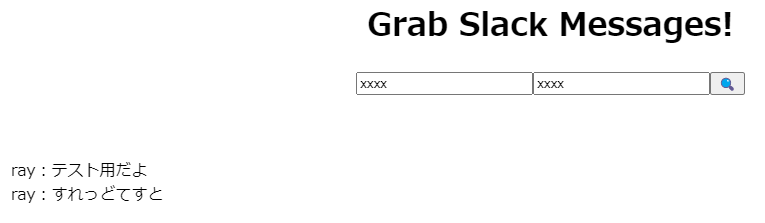

<h1 align="center">grab-slack-messages</h1>

    <strong>Web Service for grabbing messages(+thread) from Slack.</strong>

 

    
        Glab Slack thread messages. 
        This Service is provided using Google Web Service.
    

 

## Table of Contents
- [How to use](#how-to-use)
- [Features](#features)
- [Author](#author)
- [LICENSE](#license)

## How to use

1. Access the following URL.
https://script.google.com/macros/s/AKfycbxlLvr74frGxPEc2TWjGg1GvTOVj14OaGXEBvWX9MvEKFMf4zvgmXtSQklkcaPLT-5TNA/exec
1. Input Slack API token.
1. Input Slack Message link that the root message you want to get.
1. Push the button.

The result.

## Features
- Text Only.

## Author
[LiuToki](https://github.com/LiuToki)

## License
[MIT](./LICENCE)
